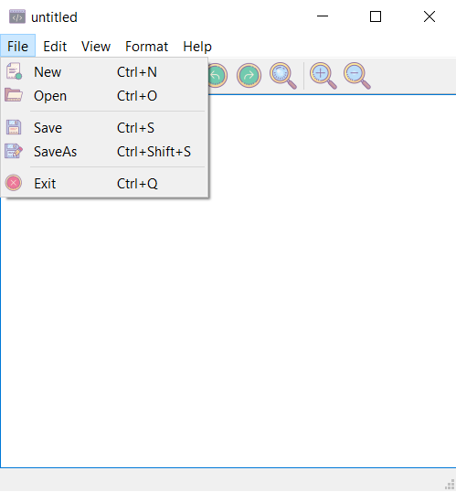

# Femto-QT

Simple text editor in Qt/C++.

## Features

- Common editor features such as new, open, save,zoom,cut,undo, redo,...
- Multiple font styles,font colors and background colors.
- Text alignment.
- Dark and light modes.
- Find.

## Screenshots

<table>
  <tr>
    <td></td>
    <td></td>
    <td></td>
    <td></td>
  </tr>
  
  <tr>
    <td></td>
    <td></td>
    <td></td>
    <td></td>
  </tr>
</table>

------------------------------------------------------------------------------

## Install Qt Creator

- Install build essential, if you don't already have it installed. This is a package that will allow users to install and use c ++ tools:

  `sudo apt update; sudo apt install build-essential`

- Install Qt Creator package that contains the UI and command line tools for creating and running the Qt project:
 
  `sudo apt install qtcreator`

- Install Qt 5 to be used as the default version of Qt Creator:

  `sudo apt install qt5-default`

- The following command will create a file with the name of **makefile** in the project directory:

   `qmake femto-QT.pro`

- Use `make` to compile the **Makefile**.
 
  As long as there are no errors in the project, this command should create an executable program in the working directory.

- To launch the executable file: 

  `./femto-QT`
  
--------------------------------------------------------------------

The icons used are from  https://icons8.com/
